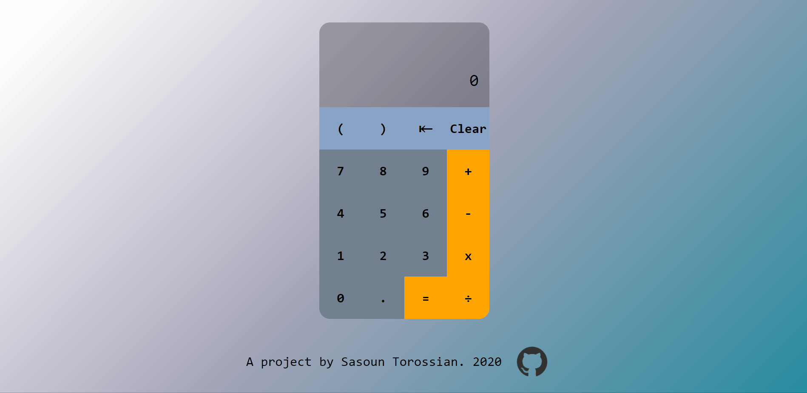

# Calculator
A calculator project, based off the Odin project curriculum. Performs basic calculator tasks of addition, subtraction, multiplication, and division. Also includes bracket functionality, as well as keyboard compatibility. Live demo can be found on github.io [here](https://sasountorossian.github.io/Calculator/). 

Calculator operates by accepting input either via button press or keyboard. Input is parsed into 3 catagories, operands (0-9, .), sign operators(=, +, -, x, /), and functionality operators(⇤, clear, (, )). Depending on the input, different functions would be called to pre-process the data, and then append to the screen.

Rest of code is to deal with edge cases, such as:
* Converting double subtraction (--) into an addition (+)
* Interpret subtraction as negative sign if preceded by non-subtraction operator (3+-2 = 1)
* Prevent double non-negative operator (++)
* Prevent three operators in a row (xxx or +--)
* Deal with multiple zeros to allow 1.001, but **not** allow 002.1
* Prevent double decimal (..)
* Implement open bracket counter to make sure all brackets are closed

In addition, rudimentary regex was used to replace bracket symbols that where not preceeded by an operator with multiplication symbols, or were followed by a decimal to append multiplication at the end.
* 56(10) will be interpreted as 56*(10)
* (10).1 will be interpreted as 10*(0.1)

Scroll of previous equations were implemented later for user to see past operations.

Decided to go for a simple design with user feedback on the button presse, and a gentle fade background with darker undertones.

The base code was very quick and easy to implement, but the edge cases took up a majority of the time. Not sure if there is a better way to handle them all. Extensive testing was also required to discover edge cases which were not immediately apparent e.g. 10(-5). Overall a good project which required some out-of-the-box thinking to solve.
